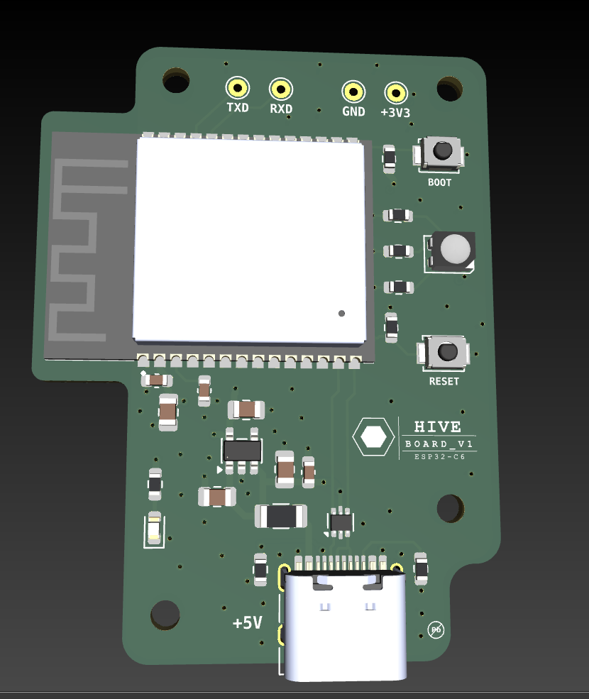
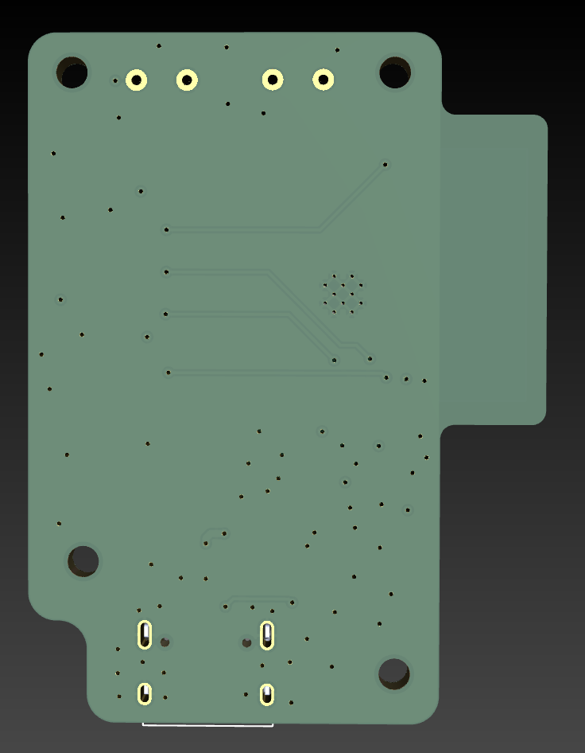

# HIVE

<p align="center">
  
</p>

<p align="center">
  
</p>

ESP32-C6 gateway board for receiving GRUNT outlet/circuit heartbeat packets.

HIVE is the central receiver in the HIVE + GRUNT monitoring system. It listens for ESP-NOW heartbeat packets from one or more GRUNT sender nodes and reports whether each monitored outlet/circuit is ON, OFF, or waiting for first heartbeat.

## Project Status

Prototype hardware designed. ESP-NOW proof-of-concept tested with an ESP32-C6 gateway and XIAO ESP32-S3 sender node.

## System Role

```text
GRUNT sender node
    ↓ ESP-NOW heartbeat
HIVE gateway board
    ↓ USB serial
Computer / future dashboard
```

## Hardware

Main parts:

- ESP32-C6-WROOM-1-N8 module
- USB-C power and data
- AP2112K-3.3 voltage regulator
- USBLC6-2P6 USB ESD protection
- BOOT and RESET buttons
- RGB status LED
- Power LED
- UART debug pads
- 4-layer PCB with internal GND plane

## Power

HIVE is powered from USB-C VBUS.

```text
USB-C VBUS → fuse/protection → +5V
+5V → AP2112K-3.3 → +3.3V
+3.3V → ESP32-C6-WROOM-1-N8
```

## USB-C

USB-C is used for both power and native ESP32-C6 USB data.

```text
USB D- → ESP32-C6 GPIO12 / USB_D-
USB D+ → ESP32-C6 GPIO13 / USB_D+
CC1 → 5.1k → GND
CC2 → 5.1k → GND
USB shield → GND
```

## Firmware Behavior

HIVE receives heartbeat packets from GRUNT nodes over ESP-NOW.

Each packet contains:

```cpp
typedef struct {
  char nodeId[16];
  uint32_t counter;
  uint32_t uptimeMs;
} HeartbeatPacket;
```

HIVE tracks the last-seen time for each node.

```text
recent heartbeat → node is ON
timeout expired  → node is OFF / missing
never seen       → node is UNKNOWN
```

## PCB Notes

Recommended layer strategy:

```text
T.SIGNAL → components, USB, local signals
GND      → solid internal GND plane
PWR      → +3.3V pour / power routing
B.SIGNAL → GND pour and slow signals
```

Antenna keepout must block copper on all layers:

- No tracks
- No vias
- No pads
- No zone fills
- No components

## Safety Note

HIVE is a low-voltage USB-powered gateway. It does not connect directly to mains voltage.

## Known Notes

- HIVE is the receiver/gateway board.
- GRUNT is the sender/outlet node.
- ESP-NOW devices must be on the same Wi-Fi channel.
- The ESP32-C6 module antenna keepout is critical for reliable wireless performance.
- UART debug pads are included as a backup even though native USB is used.